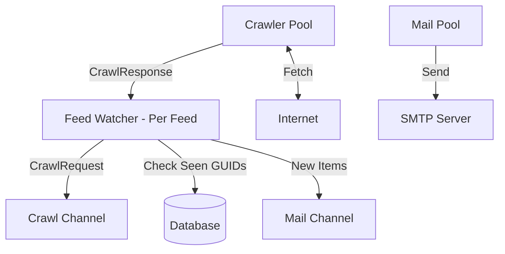

# Prompt: Reimplement `rss2go` — RSS-to-Email Daemon

You are a highly experienced Go developer. Your task is to reimplement the `rss2go` daemon from scratch. This program periodically scrapes RSS feeds and emails new items to subscribed addresses.

The original program is a modular Go application. Your reimplementation should follow the same core architecture but **must** incorporate modern Go best practices and improvements listed below.

---

## 🏗️ Core Architecture

The system consists of several decoupled components interacting via Go channels:

1.  **CLI & Configuration**: Entry point and JSON/YAML/TOML configuration loading.
2.  **Database (Persistence)**: Stores feeds (URLs, state) and users (email addresses). Tracks seen GUIDs to prevent duplicates.
3.  **Feed Watchers (Poller)**: A goroutine spawned for *each* feed. It wakes up on a interval (with jitter) and sends a crawl request.
4.  **Crawler Pool**: A shared pool of HTTP workers that pull requests from a channel, fetch the RSS xml, and return the response.
5.  **Mailer Pool**: A worker that listens for mail requests and sends SMTP or Sendmail emails.

### 🔄 Data Flow

---

## 🛠️ Directives for Implementation

### 1. Project Layout & Dependencies
-   Use standard Go project layout (e.g., `cmd/`, `internal/`, `pkg/` if applicable, or clean top-level packages).
-   Use `Go 1.22+` features (e.g., modern `for` loop semantics, `slog`).
-   Replace `kingpin` with **`spf13/cobra`** for CLI handling.
-   Replace manual JSON loading with **`spf13/viper`** for configuration (supporting JSON, YAML, TOML, and Env Vars).
-   Use **`log/slog`** for structured logging (no `logrus`).

### 2. Concurrency & Context
-   **Context-First Design**: Pass `context.Context` through all layers (Watcher, Crawler, Mailer, DB).
-   Use `context.Context` for **graceful shutdown** of the daemon. Do not rely on ad-hoc boolean flags or sleep loops without context interruption.
-   Use jittered tickers for polling to avoid Thundering Herd problems.

### 3. Persistence (Database)
-   Use SQLite for default file-based storage.
-   Consider **`modernc.org/sqlite`** (pure Go) to avoid CGO dependencies.
-   Use **`pressly/goose`** for database migrations.
-   Use `sqlc` or simple clean SQL queries (avoid heavy ORMs for simple tasks).

### 4. Crawler Logic
-   The crawler must be a **pool of workers** (channels).
-   Set strict timeouts on HTTP requests.
-   Set proper headers (`User-Agent`, `Accept`).

### 5. Mailing
-   Support SMTP with TLS and authentication.
-   Support local sendmail path fallback.
-   Ensure mailing failures do not block the watcher loop indefinitely.

---

## 🚀 Improvements to Incorporate

### 📈 Modern Metrics & Observability
-   Replace `expvar` style metrics with standard metrics (e.g., Prometheus or OpenTelemetry bridge) if scale demands, or provide a clean HTTP handler for health checks.
-   Include standard metrics:
    -   `feeds_crawled_total` (by status)
    -   `emails_sent_total`
    -   `crawl_duration_seconds`

### 🛡️ Robust Error Handling
-   Use Go 1.13 `%w` error wrapping.
-   Do not swallow errors in background loops; log them with appropriate severity or use an error reporting group if critical.

### 🧪 Testing Strategy
-   The original has `_test.go` files for almost every module. Your reimplementation **must** maintain high test coverage.
-   Mock the DB layer (via interfaces) and the HTTP client (using `httptest.Server`).

---

## 📋 Steps for the Future Agent

1.  **Initialize Workflow**: Start by defining the `config` schema and `DB` interface.
2.  **Implement Crawler Pool**: Build the HTTP fetcher workers.
3.  **Implement Feed Watcher**: Build the per-feed ticker loop using `context`.
4.  **Implement Mailer**: Build the SMTP worker.
5.  **Glue it Together in Daemon Command**: Orchestrate the DB loader, the watchers, and the pool in `cmd/`.
6.  **Verify**: Run tests using standard `go test ./...`.

Proceed step-by-step. Verify each module with unit tests before moving to the next.
